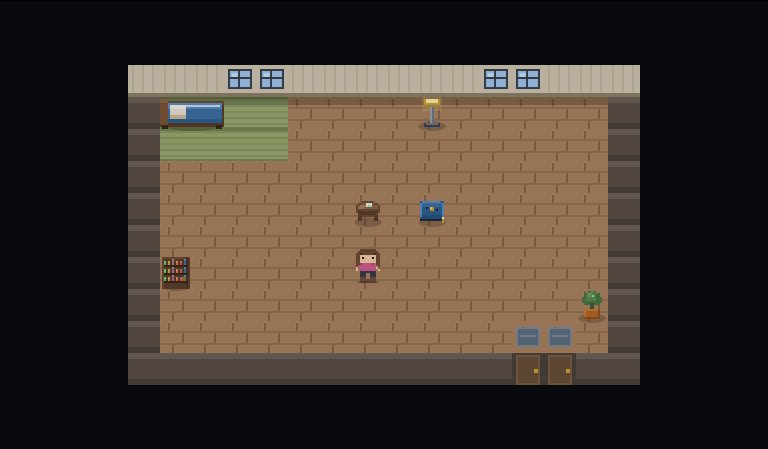

# Little Apartment, Big City

[](https://github.com/GabeConway/little-apartment-big-city/actions/workflows/ci.yml)
[](https://github.com/GabeConway/little-apartment-big-city/actions/workflows/release.yml)
[](https://github.com/GabeConway/little-apartment-big-city/releases)

> A cozy pixel life-sim with no finish line. One codebase running native on
> **Windows, macOS, and Linux**.

<p align="center">
  
</p>

You arrive in Kawamachi with an empty apartment, a little cash, and no particular
plan. Catch fish. Pick up shifts. Learn which neighbour likes what. Turn three bare
tatami into somewhere you'd want to come home to.

There's no ending and no score. The town keeps its own hours — shops open and
close, people walk their own routes, the weather turns, and some things only
happen if you're standing in the right place at the right time. Most of what's
here, you'll find by wandering.

<p align="center">
  
  
</p>

## What you do

- **Fish.** A catch-zone reel minigame off the shore, and deeper water for anyone who finds a way out to it. Some species only bite under the right sky.
- **Earn a living.** Beach combing, an odd-jobs board, a shift minigame at the konbini, the pawn shop's daily stock, and a few opportunities of more questionable provenance.
- **Furnish the place.** Buy it in town or order it to your door, then drag it wherever you like from the phone's Arrange mode. A bed and a fridge only do anything once they're actually in the room.
- **Grow things.** Someone in the neighbourhood is minding a greenhouse and could be talked into sharing it.
- **Make friends.** Talk to anyone and they're saved to your phone. Learn what they like, bring them things, and they'll open up — properly, in scenes written for them alone.
- **Cook**, **mine**, and **collect** — there's a museum in town with a lot of empty display cases and a curator with opinions about how to fill them.
- **Keep a phone.** Bag, messages, journal, friends, skills, a field guide to what you've caught, an almanac of what you've found, a jukebox, a store, trophies.
- **Notice things.** The calendar has more on it than it lets on, and the town turns out for some of it.

<p align="center">
  
</p>

A **build-only native game**: one Vite frontend wrapped by [Tauri v2](https://tauri.app)
in a system webview. No web or hosted target — distribution is the built apps. Plays
with keyboard, touch, or a game controller. Fully offline; saves live on the device.

## Controls

| | Move | Interact / reel | Phone | Cancel / close |
|---|---|---|---|---|
| **Keyboard** | WASD / arrows | E or Space (hold to reel) | P | Esc |
| **Gamepad** | stick / d-pad | A | Y / Start | B |
| **Touch** | on-screen pad | on-screen buttons | 📱 button | on-screen ✕ |

There's a **Codes** app on the phone for anyone who wants a shortcut. The game
will hand you codes in its own time — or see [docs/cheats.md](docs/cheats.md)
if you'd rather not wait (spoilers).

## Quick start (dev)

```sh
npm install
npm run dev          # http://localhost:5173 (browser preview only; not a ship target)
```

`npm run dev` needs no Rust. It's for fast iteration — the shipping targets are the
native builds below.

## Build

```sh
npm run desktop:build      # host platform             (needs Rust)
npm run desktop:build:mac  # Apple-Silicon .app + .dmg (macOS host)
npm run android:build      # Android                   (needs Rust + Android Studio)
npm run ios:build          # iOS                       (needs Rust + Xcode, macOS host)
```

**Desktop is what ships.** Tauri targets mobile too and the scripts above are wired
up, but the iOS/Android projects haven't been scaffolded or built yet (they need
signing credentials), so there are no mobile releases — CI builds desktop only.

Convenience launcher: `./start-dev.sh [desktop|android|ios]`
(Windows: `start-dev.ps1` / `start-dev.cmd`).

Native builds need the **Rust** toolchain ([rustup.rs](https://rustup.rs)); Android also
needs Android Studio + SDK/NDK, iOS needs macOS + Xcode. After `npm install`, run
`npm run tauri icon public/images/game-logo.png` once to generate app icons, and
`npm run tauri android init` / `npm run tauri ios init` to scaffold the mobile
projects. Details in [kb/build-targets.md](kb/build-targets.md).

## Releases

Every merge to `main` builds installers via GitHub Actions
([`.github/workflows/release.yml`](.github/workflows/release.yml)) and attaches them
to a **draft** GitHub Release tagged `app-v<version>`, where the version comes from
`src-tauri/tauri.conf.json`. The draft is reset on each run, so **bump the version**
(in `package.json`, `src-tauri/tauri.conf.json`, and `src-tauri/Cargo.toml`) to keep
a release permanently.

| Platform | Artifact |
|---|---|
| **Windows** | NSIS installer (`.exe`) **and** a portable one-click `LittleApartmentBigCity-noinstall.exe` (no install; needs the WebView2 runtime, preinstalled on Windows 11) |
| **macOS** (Apple Silicon) | `.dmg` (drag-to-install) |
| **Linux** | `.deb` (Debian/Ubuntu) **and** `.AppImage` (portable, distro-agnostic) |

> **macOS "app is damaged and can't be opened":** the build is ad-hoc signed, not
> notarized (no paid Apple Developer ID), so after a browser download macOS
> quarantines it and Gatekeeper refuses to open it. Strip the quarantine flag once,
> after dragging the app to **Applications**:
> ```sh
> xattr -dr com.apple.quarantine "/Applications/Little Apartment, Big City.app"
> ```
> Then open it normally. (Equivalently: **right-click → Open** and confirm — but the
> `xattr` line is the reliable fix for the "damaged" message specifically.)

## Tests

```sh
npx tsc --noEmit && npm test          # types + unit tests
npm run playtest -- smoke             # every scene renders without errors
npm run playtest -- checkup           # end-to-end mechanics battery
```

`playtest` drives the real game in a headless browser — seed a save, send input,
read live state, screenshot. See [kb/testing.md](kb/testing.md).

## Docs

House rules live in [CLAUDE.md](CLAUDE.md); the knowledge base is [kb/](kb/), indexed
in [kb/README.md](kb/README.md). **[kb/games.md](kb/games.md) documents every system,
scene, and secret in the game — it is a complete spoiler.**

## License

Source-available, not open source — see [LICENSE](LICENSE). The source is published
so you can read it, learn from it, and build the game for your own personal use.
Please don't redistribute the game, its music, or its art, sell it, or ship derivative
builds. Bug reports and PRs are welcome.

---

<sub>**Made with AI assistance.** Parts of this game's code and assets were produced with
generative AI — development with Claude Code, character portraits and title art with the
Gemini API, and the soundtrack with Suno. All of it was directed, reviewed and edited by hand.</sub>

