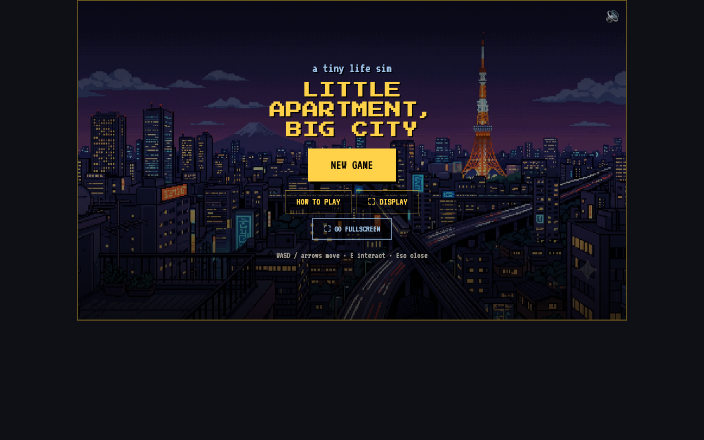
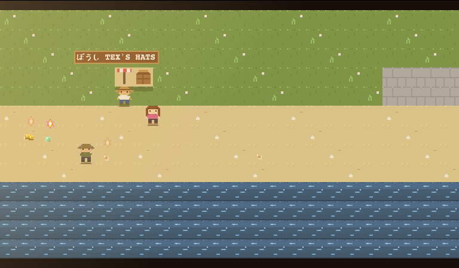
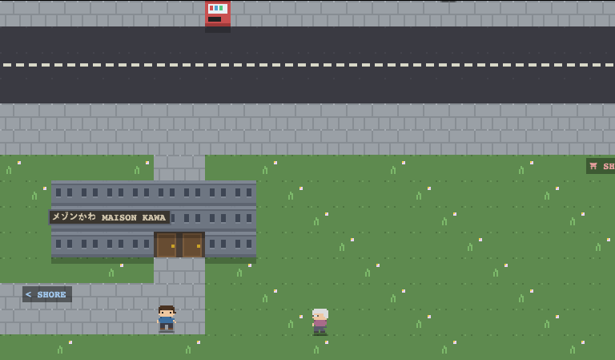

# Little Apartment, Big City

> A cozy pixel life-sim with no finish line. Fish the shore, work odd jobs, furnish a tiny apartment, befriend the neighbourhood, and turn up the city's hidden secrets at your own pace — one codebase running native on **Windows, macOS, Linux, iOS, and Android**.

<p align="center">
  
</p>

You arrive in Kawamachi with an empty apartment and not much money. Catch fish,
pick up konbini shifts, hunt pawn-shop bargains, and slowly turn three bare tatami
into a home. Wander a downtown full of neon, find the island past the bay, and
the crack behind the konbini that leads somewhere it shouldn't.

A **build-only native game**: one Vite frontend wrapped by [Tauri v2](https://tauri.app)
in a system webview. No web/hosted target — distribution is the built apps. Plays
with keyboard, touch, or a game controller. Fully offline; saves live in the device.

<p align="center">
  
  
</p>

## What you do
- **Fish** the shore, the deep bay (from a skiff), and a tropical island — a catch-zone reel minigame, 8+ species, rarer the harder; the old fisherman Genji sells an upgraded rod.
- **Earn yen** every way the town allows: fishing, **beach foraging** (washed-up finds you grab each morning), the **odd-jobs board** by home (a daily fetch errand), a **konbini shift minigame** ("Register Rush" — scan, bag, make change against the clock), the daily pawn stock, mining, and Jimmy's sketchy back-of-a-truck deals.
- **Furnish the apartment** — buy furniture (or order it from **ZamaZonk** on your phone for next-morning delivery), then drag-and-drop it anywhere in the room from the phone's **Arrange** mode. A bed, fridge, AC and kotatsu only do anything once they're placed. Furnish all ten for a quiet little homecoming — but there's no "winning," just more city to find.
- **Grow things** — do Granny Soto a favor (she loves a fresh fish) to unlock the **community greenhouse**, then plant, water, and harvest crops on the day/night cycle.
- **Make friends** — strike up a conversation with anyone in town and they're saved to your phone; bring them gifts they like to raise hearts and unlock perks. Get close enough and they open up in one-of-a-kind heart-to-heart scenes, and even drop by your apartment one morning. Meet everyone for a special send-off.
- **Find what's hidden** — the real pull is discovery: a sea cave behind the island volcano, a stranger who only walks at midnight, a message in a bottle, constellations over the shore, and rare **meteor-shower** nights you can wish on.
- **Catch the day's happenings** — a different little **street event** turns up in the city most days (a ramen cart, a magician, a claw machine, a lost ferret), and the weather rolls between clear, rain, and fog.
- **Carry a smartphone** — bag, messages, a **Journal**, **Friends**, a **Fishopedia** of everything you've caught, an **Almanac** tracking every discovery in town, **Skills**, a jukebox, the ZamaZonk store, trophies, and settings, all in a pocket phone (press **P**).
- **Explore 19 hand-built scenes** — Kawamachi St., neon Downtown, Club Kaiju, the gachapon hall, the shrine, the greenhouse, the Kawamachi Museum, a much bigger Kiwami Island (volcano, lagoon, hot spring), Paris, and the backrooms-and-mines under the konbini freezer.
- **Donate to the museum** — Bingus Doofelsmurt's gallery has display cases waiting for objects of interest you find out in the world.
- **Get around** — buy a kei car and an old skiff.
- A living **day/night cycle**: energy, sleep, and a 2 AM collapse that carries you home anyway. **22 achievements**, dialogue portraits, a magical-girl wand for the crawlers in the mines, and per-scene music.

## Controls
| | Move | Interact / reel | Phone | Cancel / close |
|---|---|---|---|---|
| **Keyboard** | WASD / arrows | E or Space (hold to reel) | P | Esc |
| **Gamepad** | stick / d-pad | A | Y / Start | B |
| **Touch** | on-screen pad | on-screen buttons | 📱 button | on-screen ✕ |

## Cheat codes
Open the phone (**P** / 📱) → **Codes** app, type a code, APPLY:

| Code | Effect |
|---|---|
| `motherlode` | +¥50,000 |
| `redbull` | Refill energy |
| `rocks` | +10 of every mineral |
| `gimmegimme` | Unlock all base furniture (into your boxes) |
| `country roads` | Teleport home to the apartment |
| `sunrise` | Set time to 7:00 AM (morning) |
| `nightfall` | Set time to 10:00 PM (night) |
| `midnight` | Set time to 1:30 AM |
| `come again another day` | Force rain for the current day |

## Quick start (dev)
```sh
npm install
npm run dev          # http://localhost:5173 (browser preview only; not a ship target)
```
`npm run dev` needs no Rust. It's for fast iteration — the shipping targets are the native builds below.

## Build
```sh
npm run desktop:build      # host platform        (needs Rust)
npm run desktop:build:mac  # Apple-Silicon .app + .dmg  (macOS host)
npm run android:build      # Android              (needs Rust + Android Studio)
npm run ios:build          # iOS                  (needs Rust + Xcode, macOS host)
```
Convenience launcher: `./start-dev.sh [desktop|android|ios]`
(Windows: `start-dev.ps1` / `start-dev.cmd`).

## Releases
Every merge to `main` builds installers via GitHub Actions
([`.github/workflows/release.yml`](.github/workflows/release.yml)) and attaches
them to a draft GitHub Release:

| Platform | Artifact |
|---|---|
| **Windows** | NSIS installer (`.exe`) **and** a portable one-click `LittleApartmentBigCity-noinstall.exe` (no install; needs the WebView2 runtime, preinstalled on Windows 11) |
| **macOS** (Apple Silicon) | `.dmg` (drag-to-install) |
| **Linux** | `.deb` (Debian/Ubuntu) **and** `.AppImage` (portable, distro-agnostic) |

> **macOS "app is damaged and can't be opened":** the build is ad-hoc signed, not
> notarized (no paid Apple Developer ID), so after a browser download macOS
> quarantines it and Gatekeeper refuses to open it. Strip the quarantine flag once,
> after dragging the app to **Applications**:
> ```sh
> xattr -dr com.apple.quarantine "/Applications/Little Apartment, Big City.app"
> ```
> Then open it normally. (Equivalently: **right-click → Open** and confirm — but the
> `xattr` line is the reliable fix for the "damaged" message specifically.)

## Tests
```sh
npm test             # Vitest unit tests (run once)
npm run test:watch   # watch mode
```
There's also a headless **playtest harness** that drives the real game in a
browser — seed a save, send inputs, read live state, screenshot. See
[kb/playtesting.md](kb/playtesting.md).

## Native prerequisites
Native builds need the **Rust** toolchain ([rustup.rs](https://rustup.rs)); Android also needs
Android Studio + SDK/NDK; iOS needs macOS + Xcode. After `npm install`, run
`npm run tauri icon public/images/game-logo.png` once to generate app icons, and
`npm run tauri android init` / `npm run tauri ios init` to scaffold the mobile projects.
See [kb/build-targets.md](kb/build-targets.md).

## Docs
Architecture and house rules live in [CLAUDE.md](CLAUDE.md) and [kb/](kb/). The game
itself — every system, scene, and hard rule — is documented in [kb/games.md](kb/games.md).
